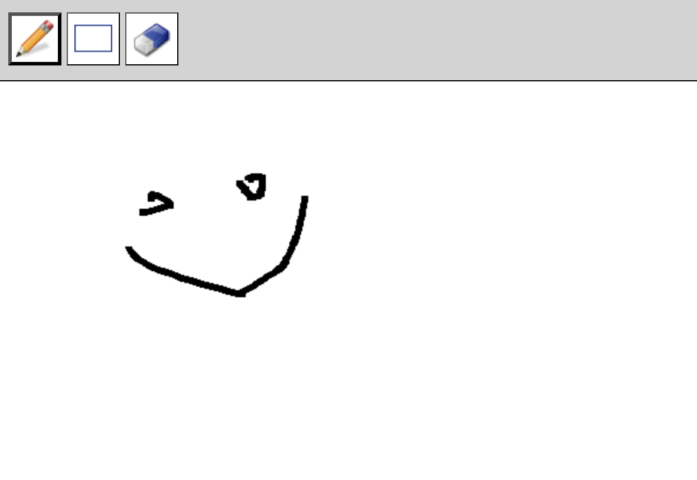

# Classkick Front End Engineering Take Home Project

## Intro
Welcome! and thank you for taking the time to complete the Classkick take-home challenge for our Senior/Staff Frontend Engineer position.

You will have 3 days to complete the project. Once you have completed your solution, please reply with a link to a forked GitHub repository or your folder with any helpful instructions for us.

## Motivation
At Classkick, our teachers and students LOVE using our [Canvas](https://developer.mozilla.org/en-US/docs/Web/API/Canvas_API/Tutorial) feature to create fun and engaging content.

This project emulates the type of scenarios we face at Classkick, with similar technical challenges regarding UI and real-time UX.

## Goal
Your task is to create a [Canvas](https://developer.mozilla.org/en-US/docs/Web/API/Canvas_API/Tutorial) element to:
- Create a `Drawing`
- Create a `Textbox`
- Add an `Eraser Tool`. The Eraser UX is left up to your design decisions. Here are 3 examples of how it could function, but you can design your own function as well.
    - The eraser acts like a smudge eraser.
    - When a user smudges over a line in eraser mode, that erases the entire line.
    - When a user points and clicks a line, it erases.

**[Bonus]**: Add other tools like Colors, Images, or something else!

## Requirements:
 - Your app does NOT have to be hooked up to a backend and thus it does NOT have to preserve state. 
 - It should be clear in your code and/or documentation on areas for eg:
    - Design/Technical decisions
    - Where and how this would hook up to a Backend service eg: Firebase
 - Create components as you feel is best suited for your solution

## Mocks

## Setup Guide
[SETUP GUIDE](SETUP.md)

Good luck and if you have questions, please reach out to us at hiring@classkick.com

